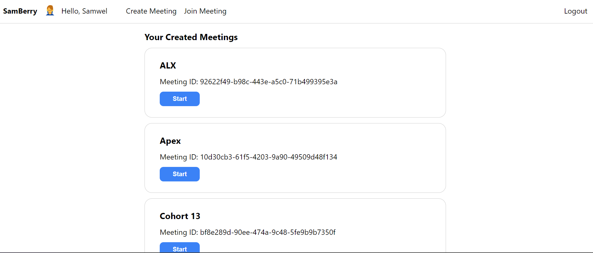
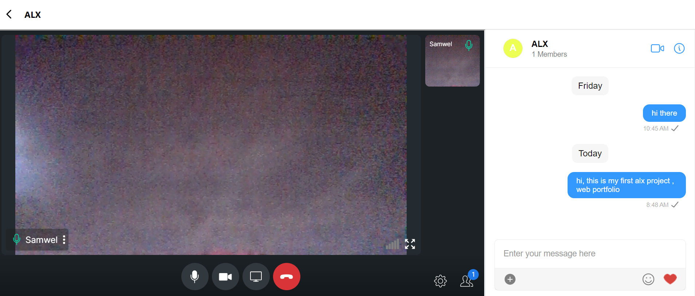

# ALX Webstack - Portfolio Project

<p align="center">
  <a href="https://github.com/samwelnyandoro/samberry" target="_blank" rel="noreferrer"></a>
</p>

 <a href="https://github.com/samwelnyandoro/samberry" target="_blank" rel="noreferrer"></a>
</p>

# Samberry - Basic Meeting Web App

Samberry is a simple web application for scheduling and managing meetings.

## Features

- **User Authentication**: Users can sign up and log in to the system.
- **Meeting Creation**: Users can create new meetings with details such as title, date, time, and participants.
- **Meeting Management**: Users can view, edit, and delete meetings they have created.
- **Invite Participants**: Users can invite participants to their meetings via email.
- **Meeting Notifications**: Participants receive notifications about upcoming meetings.

## Framework and Libraries used

- Frontend: ReactJS/Redux
- Backend: Node.js, Express.js
- Socket.IO and CometChat React SDK for chat,video, audio and user authentication
- Mediasoup is more stable than standard WebRTC and does not require a STUN / TURN server

## Getting Started

To run the demo follow these steps:

1. [Head to CometChat Pro and create an account](https://app.cometchat.com/signup)
2. From the [dashboard](https://app.cometchat.com/apps), add a new app called **"samberry"**
3. Select this newly added app from the list.
4. From the Quick Start click on credentials and copy the **APP_ID, APP_REGION and AUTH_KEY**. These will be used later.
5. Also copy the **AUTH_KEY** from the Auth Keys tab.
6. Navigate to the Users tab, and delete all the default users and groups leaving it clean **(very important)**.
7. Download the repository [here](https://github.com/samwelnyandoro/Samberry-Meeting-Web-App-with-Audio-and-Video-via-Node.js-and-React/archive/main.zip) or by running `git clone https://github.com/samwelnyandoro/Samberry-Meeting-Web-App-with-Audio-and-Video-via-Node.js-and-React.git` and open it in a code editor.
8. Create a file called **.env** in the root folder of your project.
9. Create the content of the **.env** file as follow.

```js
REACT_APP_COMETCHAT_APP_ID=xxx-xxx-xxx-xxx-xxx-xxx-xxx-xxx
REACT_APP_COMETCHAT_REGION=xxx-xxx-xxx-xxx-xxx-xxx-xxx-xxx
REACT_APP_COMETCHAT_AUTH_KEY=xxx-xxx-xxx-xxx-xxx-xxx-xxx-xxx
```

10. Make sure to exclude **.env** in your gitIgnore file from being exposed on
11. We will use the MySQL database. For this reason, this section describes how to create the database and its table. Before proceeding, you need to make sure that you have installed the MySQL database on your computer already. To create the database and its table, you need to get the samberry.sql and run it.
12. Create .env file and replace the below information with the information of your database connection.
```js
PORT=3000
DB_HOST=localhost
DB_USER_NAME=alx
DB_USER_PASSWORD=xxxxx
DB_NAME=samberry
DB_PORT=3306
```
13. Run the following command to install the app.

```sh
    npm install
    npm run start
    npm run dev ~~ to start the node server
```

## Contributing

Contributions are welcome! Please fork the repository and submit a pull request with your changes.

## License

This project is licensed under the [MIT License](https://opensource.org/licenses/MIT).